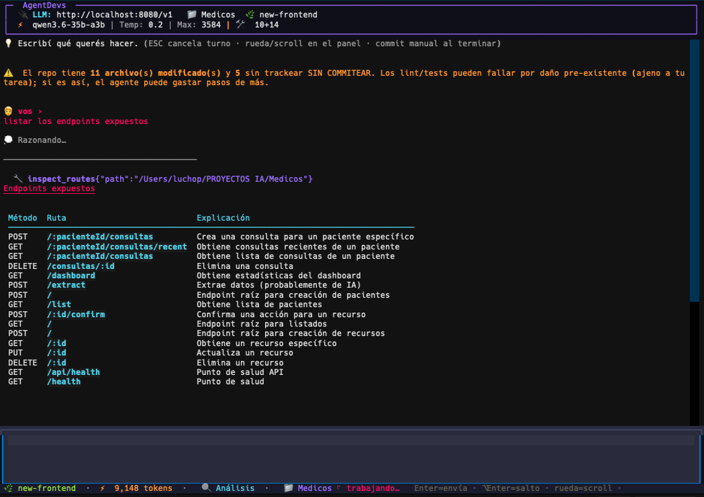
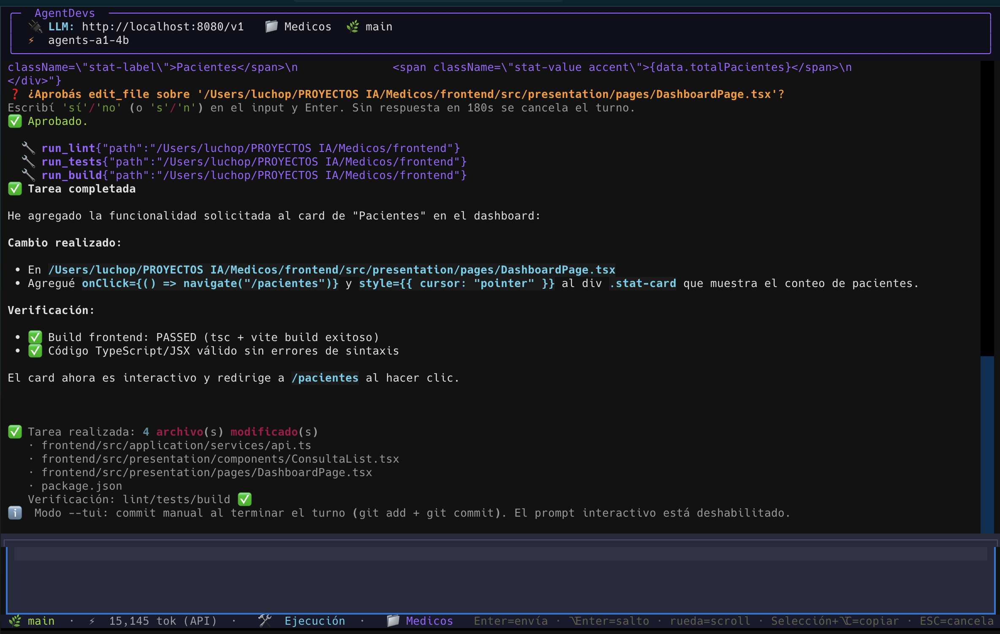

# AgentDevs

> Tu par de programación con IA, corriendo **100% local** en tu máquina.
> Sin nube. Sin API keys. Tu código nunca sale de tu compu.

AgentDevs es un agente de desarrollo que **analiza, planifica, implementa y revisa código** en tus repositorios usando un LLM local (llama.cpp). Le decís qué querés en lenguaje común y él explora el proyecto, propone un plan, escribe los cambios y —antes de darte por servido— corre lint, tests y build para verificar que lo que entregó compila.



*Sesión real: el usuario pide los endpoints expuestos; `inspect_routes` los devuelve en una llamada y la tabla sale renderizada en la TUI.*



*Sesión real: el usuario pide que el card "PACIENTES" navegue a `/pacientes`; el agente pide aprobación, aplica `onClick`, corre `lint/tests/build` y entrega con `✅ Tarea completada`.*

## ¿Por qué AgentDevs y no otra cosa?

- **Privacidad total**: todo corre en tu hardware. Ideal para código proprietary o sensible.
- **Trabajo por roles, como un equipo real**: cada tarea pasa por el rol correcto (`analyze`, `plan`, `execute`, `review`) con tools y presupuestos propios.
- **Entiende la arquitectura, no solo los archivos**: se integra con [codebase-memory-mcp](https://github.com/DeusData/codebase-memory-mcp) (knowledge graph del código) para responder "¿cómo está armado este proyecto?" con clusters, capas y dependencias reales.
- **Guardas anti-desastres**: tope de tool calls por turno, límite de edits por archivo, detección de escrituras truncadas, compuerta de verificación que obliga a lint/tests/build antes de cerrar un cambio.
- **Tareas grandes por lotes**: si le pedís tocar 14 archivos, divide en batches persistidos que sobreviven cortes y rotación de sesión.
- **TUI full-screen**: scroll, click-to-edit, selección/copiado y respuestas con markdown renderizado (tablas, código, headers).

## Benchmarks (medidos, reproducibles)

- Pilot propio (12 tareas Python, 4B local): **12/12**.
- Aider Polyglot primeras 25 (5×5 python/js/go/java/cpp), mismo harness y pins:
  4B local **2/25 (8%)**, Qwen3.6-35B **19/25 (76%)** — py 5/5, js 4/5,
  go 3/5, java 4/5, cpp 3/5.
- Logs completos por tarea (records + salidas de verificación) en `benchmarks/polyglot-225/`.

## Instalación

### One-liner (macOS / Linux)

```bash
curl -fsSL https://raw.githubusercontent.com/LucianoDPerez/agent-devs/main/install.sh | bash
```

Clona el proyecto en `~/.agent-devs`, crea el entorno, deja el comando global **`agent-devs`** en tu PATH y corre la verificación completa. Re-ejecutarlo actualiza el checkout (`git pull`).

### Windows (PowerShell)

```powershell
irm https://raw.githubusercontent.com/LucianoDPerez/agent-devs/main/install.ps1 | iex
```

### Desde un clone (si preferís tener el código a mano)

```bash
git clone https://github.com/LucianoDPerez/agent-devs.git && cd agent-devs
./install.sh        # o .\install.ps1 en Windows
```

El instalador se encarga de todo:

1. Crea el entorno virtual (`.venv`) e instala las dependencias.
2. Instala el paquete en modo editable → comando global **`agent-devs`** desde cualquier carpeta.
3. Instala [codebase-memory-mcp](https://github.com/DeusData/codebase-memory-mcp) si falta (macOS/Linux).
4. Corre **`agent-devs doctor`**: verifica Python, git, dependencias, MCP y llama-server; lo que puede, lo instala solo; lo que no, te dice exactamente cómo resolverlo.

### Actualizar

Cuando saquemos cambios nuevos:

```bash
agent-devs --update       # git pull + reinstall editable, muestra de qué commit a cuál
```

También podés re-correr el one-liner de instalación: detecta la instalación existente y actualiza en vez de duplicar.

## Empezar a usarlo

**1. Levantá el modelo** (llama-server escuchando en `http://localhost:8080`, el default):

```bash
llama-server -hf unsloth/Qwen3-4B-Instruct-2507-GGUF:Q4_K_M --port 8080
```

El doctor (`agent-devs --doctor`) detecta tu RAM y te marca tu liga. Resumen (siempre `--port 8080`):

| Tu RAM | Comando | Pesa | Nota |
|---|---|---|---|
| 16GB | `llama-server -hf bartowski/InternScience_Agents-A1-4B-GGUF:Q4_K_M` | ~2.5GB | probado en el banco 6/7; alt. Spark-X2.5-4B (mejor agentic, pero exige el fork `XHToken/llama.cpp`) |
| 24GB | `llama-server -hf unsloth/Qwen3.6-35B-A3B-GGUF:UD-Q3_K_XL` | ~17GB | medido acá (Q3_XXS): 19/25 Polyglot — el Q4_K_M (22GB) no entra en 24GB con margen de KV, usar quants chicos |
| 32GB | `llama-server -hf unsloth/Qwen3.6-35B-A3B-GGUF:UD-Q4_K_M` | ~22GB | lo mejor medido: 7/7 + 19/25 Polyglot; Terminal-Bench 2.0 oficial: 51.5 (vs 41.6 del 27B) |
| 64GB+ | `llama-server -hf unsloth/Qwen3.6-35B-A3B-GGUF:UD-Q5_K_XL` | ~27GB | misma familia, quant mayor; o Qwen3.8-27B Q4_K_M (~17GB) como alt liviano |

> Solo recomendamos familias que pasaron por el banco con tool calling real. Qwen3 base no está probado acá — no lo recomendamos.
> Flujo que rinde: planificá con un modelo frontera, ejecutá en local, y juzgá con otro modelo distinto al executor.

**2. Andate a cualquier proyecto y hablale:**

```bash
cd /ruta/a/tu/proyecto
agent-devs .
```

El `.` le dice que trabaje sobre el directorio actual (también acepta una ruta explícita).

### Qué le podés pedir

| Querés… | Probale… |
|---|---|
| Entender el proyecto | *"explicame la arquitectura de este repo"* |
| Implementar algo | *"agregá un endpoint REST de pacientes con validación y tests"* |
| Planificar antes de codear | *"hacé un plan para migrar a Postgres"* |
| Code review | *"revisá el último commit buscando bugs y code smells"* |
| Cambios masivos | *"renombrá la entidad Consulta a Appointment en todos los archivos"* |

Cuando termina un cambio te ofrece commitearlo; nunca pushea sin que lo pidas.

## Tools pensadas para modelos chicos

AgentDevs no le tira un grep al LLM y que se arregle: las herramientas de exploración son **de alta densidad** — una sola llamada devuelve lo que a mano serían 5-10 lecturas. Menos pasos de razonamiento, menos tokens, menos lugares donde equivocarse. Los presupuestos por turno están calibrados exactamente alrededor de esto.

| Tool | Qué devuelve en una llamada |
|---|---|
| `inspect_routes` | Todos los endpoints HTTP del proyecto: método, ruta y propósito. Escanea Next.js, Express, FastAPI, Flask, Go (chi/gin), Spring, PHP y .NET |
| `inspect_models` | Todos los modelos/tablas de datos: Prisma, SQLAlchemy, Django ORM, TypeORM, Mongoose, Rails — con relaciones y archivo |
| `inspect_env` | Las variables de entorno que el proyecto necesita (lee solo `.env.example`, jamás el `.env` real) |
| `trace_component` | Un componente completo: su código fuente + quién lo usa + la página que lo renderiza |
| `search_code` | Búsqueda semántica sobre el knowledge graph del código (MCP) |
| `probe_http / capture_dev_server` | Evidencia runtime: probar una URL local o capturar los logs de arranque del dev-server |
| `run_install / run_lint / run_tests / run_build` | Verificación real según el stack detectado (npm, uv, gradle, maven…) |
| `stage_files / create_commit / git_restore` | Git seguro y acotado, sin comandos crudos |

Además, cada rol recibe **solo el subset de tools que necesita**: el rol `analyze` no puede escribir, y el retry de `execute` pierde hasta la búsqueda para forzarlo a concretar.

## Comandos

```text
agent-devs .              # abre el agente sobre el repo actual
agent-devs /otro/repo     # abre sobre una ruta específica
agent-devs --doctor       # verifica el entorno e instala lo que falte
agent-devs --update       # actualiza esta instalación (git pull + reinstall)
agent-devs --list         # lista repos ya analizados (cache)
agent-devs --analyze REPO # pre-analiza un repo sin abrir sesión
```

Dentro de la sesión: **ESC** cancela el turno en curso · **Ctrl+C ×2** sale · `/new` sesión nueva (limpia el panel) · `/compact` resume el historial para liberar contexto · `/history` últimos turnos (con id) · `/resume <id>` retoma una sesión anterior · `/autoapprove [on|off]` aprueba escrituras sin preguntar (el commit sigue manual; `/new` lo apaga) · `/verify` corre lint/tests/build ahora · `/commit todo|sesion [mensaje|ai]` commitea (`ai` deja que el LLM redacte el mensaje desde el diff) · `/tasks-pool T001-T010 [archivo] [--commit]` corre tareas en modo autónomo, un turno fresco por tarea (sin acumular contexto) · `/help` ayuda. Al tipear `/` aparece el menú de comandos (↑/↓ navegan, Enter ejecuta, Tab completa, Esc cierra).

El límite de contexto se **detecta del server** (`/props` de llama.cpp): cuando la sesión consume ~80%, AgentDevs te avisa y te ofrece compactar; al 90% compacta solo.

## Requisitos

| Componente | Requisito | Se instala solo? |
|---|---|---|
| Python | 3.10+ | — |
| git | moderno | — |
| llama.cpp (`llama-server`) | build reciente (b5000+; b6200+ si usás MTP/spec-draft) escuchando en `:8080` | detecta e instruye según tu OS |
| codebase-memory-mcp | 0.8+ | sí (macOS/Linux); Windows: manual |

> **Nota Windows**: `install.ps1` está provisto y probado en hardware Windows
> real (execution policy, paths con espacios, UTF-8). Si encontrás algún
> problema, abrí un issue.

## Solución de problemas

- **El agente no responde / cuelga al iniciar** → casi seguro falta el modelo: corré `agent-devs doctor`; si dice "nadie responde en http://localhost:8080", levantá llama-server.
- **No aparecen las tools `cm__*`** → falta codebase-memory-mcp; el doctor lo instala en macOS/Linux.
- **Quiero usar otro puerto/modelo** → editá `LLM_BASE_URL` y `LLM_MODEL_NAME` en `config.py`.

## Limitaciones conocidas (léelas antes de usar)

AgentDevs está diseñado para modelos chicos y funciona bien en tareas acotadas,
pero tiene límites medidos en nuestros benchmarks (7 tareas reales × 4 modelos,
ver `benchmarks/ANALISIS.md`):

- **Modelos chicos (4B/9B)**: completan ~86% del banco (5/5 análisis + 1/2
  ejecución). La tarea que se les escapa suele ser implementación fina.
- **Debug profundo sin stack trace**: si no pegás el error exacto (log, consola,
  stack), ningún modelo converge confiable — pegá la evidencia del error en el
  prompt.
- **PLAN no explora**: el rol planificador responde desde el análisis cacheado
  (0 tools en los 3 modelos probados) — es un gap de diseño conocido.
- **Codemod PATH FIX**: al arrancar EXECUTE, el harness corrige automáticamente
  mismatches de paths frontend↔backend (se anuncian en consola). Desactivable
  con `PATH_FIX_ENABLED = False` en `config.py`.
- **Tiempo > capacidad**: en hardware local, los executes largos pueden tardar
  decenas de minutos; los timeouts se ajustan en `config.py`
  (`LLM_TIMEOUT`, `TURN_IDLE_TIMEOUT`).

## Contacto

¿Querés contribuir, reportar algo o charlar sobre el proyecto?

- **GitHub**: [LucianoDPerez](https://github.com/LucianoDPerez)
- **Email**: [lucianoperezvic84@gmail.com](mailto:lucianoperezvic84@gmail.com)
- **LinkedIn**: [Luciano David Perez](https://www.linkedin.com/in/luciano-david-perez-6172a11a0/)

Para contribuciones grandes, escribí antes por email para coordinar el alcance.

## Cómo funciona (la versión corta)

Cada mensaje pasa por un **router** que elige el rol apropiado. Cada rol tiene su subset de herramientas acotadas: `analyze` solo lee, `execute` escribe pero queda sometido a una **compuerta de verificación** (lint/tests/build) antes de cerrar, y `review` compara contra el diff. El knowledge graph MCP le da vista arquitectural; el cache SQLite le da memoria entre sesiones; los presupuestos de tool calls evitan loops infinitos.

¿Querés la versión larga con diagramas, budgets y decisiones de diseño?

📘 **[docs/ARCHITECTURE.md](docs/ARCHITECTURE.md)**

---

*[English](README.md) · Español*
